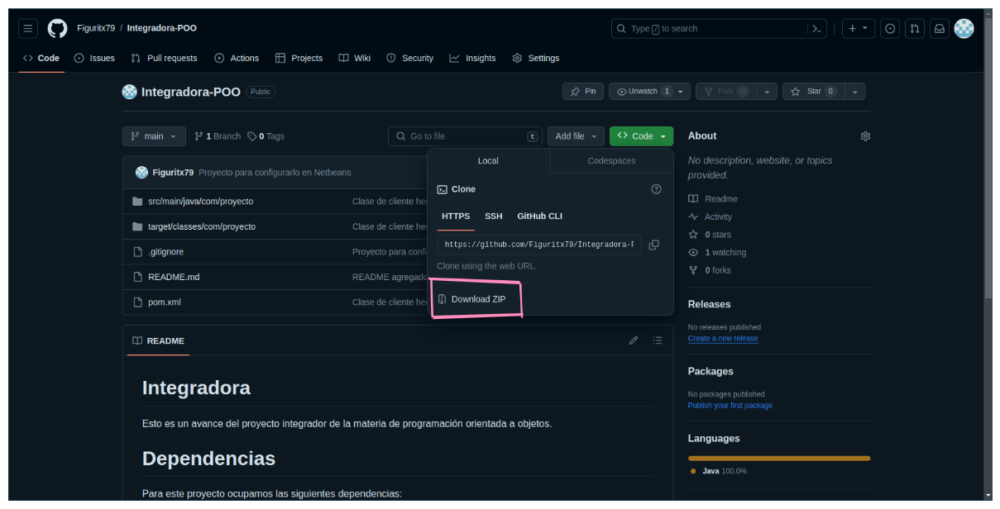
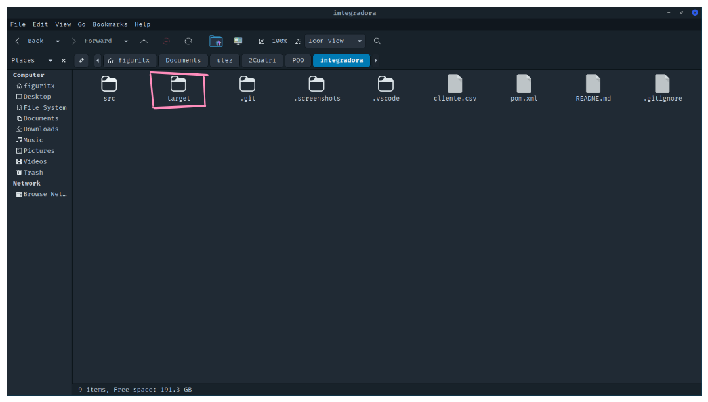
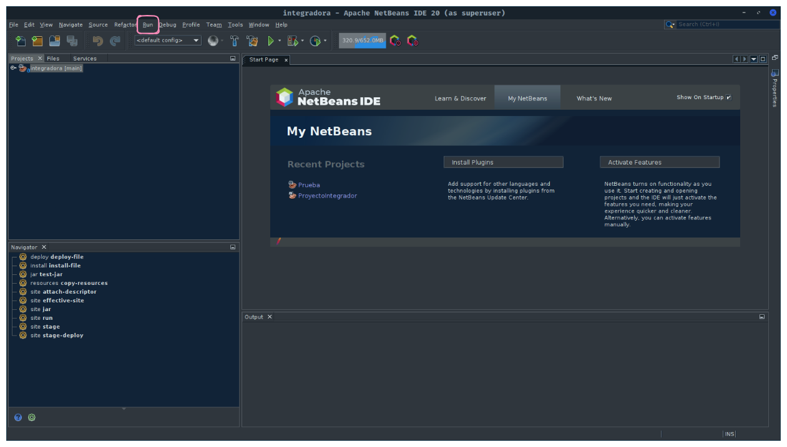

# Integradora :canoe:

Esto es un avance del proyecto integrador de la materia de programación orientada a objetos.

## Que hacer para que te funcione el proyecto correctamente

Primero vamos a clonar el repositorio(esto aplica si tiene git :octocat: ).

```bash
git clone https://github.com/Figuritx79/Integradora-POO.git
```

Si no tienes git instalado, puedes descargar el proyecto en formato zip.
</img>

Ya descargado el proyecto, lo descomprimes. Una vez descomprimido vas abrir un explorador de archivos y te vas a dirigir a la carpeta del proyecto y vas a elimar el directorio `target`.
</img>

Ya eliminado el directorio `target`, abres el IDE de tu preferencia(Netbeans). Abierto el IDE abre le proyecto y despues vamos a hacer lo siguiente:

Vamos a presionar donde dice run y vamos a darle click en `Clean and Build Project`.
</img>

# Dependencias

Para este proyecto ocupamos las siguientes dependencias:

- Common apache csv <a href="https://mvnrepository.com/artifact/org.apache.commons/commons-csv"> Para mas informacion</a>
